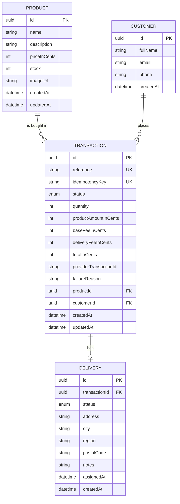

# Payment Gateway — Checkout Store Back-end

Back-end for a checkout store: a catalog API that lists tech-accessory products and their stock so customers
can browse before buying. This is the foundation of a 5-screen store flow:

1. **Product catalog** — browse all products with price and stock.
2. **Product details** — inspect a single product.
3. **Shopping cart** — add products to the cart.
4. **Checkout & payment** — pay through the payment provider.
5. **Order confirmation** — confirm and track delivery.

Today only the data behind the first two screens exists (`GET /products` and `GET /products/:id`). The rest of
the flow — cart, checkout, payment processing, delivery and the front-end — is upcoming (see
[Status & roadmap](#status--roadmap)). Money is handled as integers in COP minor units (`*InCents`), never as
floats, and card data is never stored (see [Security notes](#security-notes)).

## Tech stack

- **Back-end**: Node.js LTS, TypeScript (strict), NestJS
- **Database**: PostgreSQL via [Prisma](https://prisma.io) ORM (version 6.14 pinned)
- **Validation**: `class-validator`, `class-transformer`
- **Security**: `helmet`, scoped CORS, `@nestjs/throttler` rate limiting
- **API docs**: `@nestjs/swagger` (OpenAPI 3, Swagger UI at `/docs`)
- **Testing**: Jest (unit, colocated `*.spec.ts`) + Supertest (e2e in `back-end/test/`)
- **Monorepo layout**: `back-end/`, `front-end/` (upcoming), `docs/`, `specs/`

## Architecture

Hexagonal (ports & adapters) layout with three layers that only depend inward:

```text
back-end/
├── src/
│   ├── domain/                         # business core, no framework or infra imports
│   │   ├── entities/                   # Product
│   │   ├── ports/                      # ProductRepository (interface)
│   │   └── errors/                     # ProductNotFoundError, DataAccessError
│   ├── application/
│   │   ├── result/                     # Result type (ok/err, map, flatMap, match)
│   │   └── use-cases/                  # GetProducts, GetProductById (no Nest/Prisma imports)
│   ├── infrastructure/
│   │   ├── config/                     # env validation (fail fast)
│   │   ├── persistence/                # PrismaService, PrismaProductRepository
│   │   ├── http/                       # products controller, DTOs, error filter/mapper,
│   │   │                               # configureApp, configureSwagger, result unwrapper
│   │   └── modules/                    # Nest modules, useFactory wiring, injection tokens
│   ├── app.module.ts
│   └── main.ts
├── prisma/
│   ├── schema.prisma
│   ├── migrations/                     # hand-edited CHECK constraints
│   └── seed.ts                         # idempotent upsert with fixed UUIDs
└── test/                               # e2e (Supertest) with an in-memory fake repository
```

- **Domain** is pure TypeScript: the `Product` entity, errors and the `ProductRepository` port have no
  framework or infrastructure imports.
- **Use cases are plain classes** wired in Nest modules with `useFactory` providers and an injection token
  for the port. They never touch Prisma or Nest.
- **Controllers are driving adapters** in `infrastructure/http`: they parse input, call a use case and map the
  `Result` to an HTTP response.

### Result type and error flow

Use cases follow **Railway Oriented Programming**: they return a discriminated union `Result<Ok, Err>`
(`ok(value)` or `err(error)`) instead of throwing for business failures. Port methods throw; the Prisma adapter
wraps any failure in a `DataAccessError` keeping the original `cause`; use cases convert **only**
`DataAccessError` into `err(...)` and let any other error propagate.

Errors then flow to a single global filter:

1. The controller unwraps the `Result` (a failed result is thrown as the error).
2. `AllExceptionsFilter` catches everything, including framework errors and 404/405/429.
3. `error.mapper` maps the error to `{ statusCode, code, message }`.
4. `error-body` produces the final 5-key body with `path` and `timestamp`.
5. For server errors (5xx) the filter also logs the full failure (with its `cause` chain) on the server — the
   client only ever sees the generic body, never internals or stack traces.

## Prerequisites

- Node.js LTS and `npm`
- A local PostgreSQL server (recommended, validated) **or** Docker (optional path, not yet validated)
- `psql` (to run the CHECK constraint verification)

## Setup

### Local PostgreSQL (validated path)

1. Create the database (name it to match `DATABASE_URL`, e.g. `paymentgateway`):

   ```bash
   createdb paymentgateway
   ```

2. Copy the environment template and fill it in:

   ```bash
   cp .env.example .env
   ```

3. Install dependencies, generate the Prisma client, apply the migrations and seed:

   ```bash
   cd back-end
   npm ci
   npm run prisma:generate
   npm run prisma:migrate:deploy
   npm run prisma:seed
   ```

4. Start the API:

   ```bash
   npm run start:dev
   ```

5. Verify both endpoints and the docs:

   ```bash
   curl localhost:3000/products
   curl localhost:3000/products/77777777-7777-4777-8777-777777777777
   open http://localhost:3000/docs
   ```

   The migration scripts read the root `.env` (they run with `dotenv -e ../.env`).

### Docker Compose (optional, not yet validated)

A `postgres` service is provided in the root `docker-compose.yml` (PostgreSQL 16 alpine, named volume,
healthcheck, credentials read from the same `.env`):

```bash
docker compose up -d postgres
```

Then follow the same steps 3–5 above. This path is **not yet validated** as a clean-start flow: it moves to
the deployment feature and is documented here only as an option.

## Environment variables

All names, taken from `.env.example` (empty values; fill them in your local `.env`):

| Variable          | Used by                                  |
| ----------------- | ---------------------------------------- |
| `DATABASE_URL`    | App / Prisma                              |
| `PORT`            | App (HTTP port)                           |
| `NODE_ENV`        | App (`development`, `test`, `production`) |
| `CORS_ORIGINS`    | App (comma-separated allowed origins)     |
| `RATE_LIMIT_TTL`  | App (throttler time window, seconds)      |
| `RATE_LIMIT_MAX`  | App (throttler max requests per window)   |
| `POSTGRES_USER`   | Docker Compose only                       |
| `POSTGRES_PASSWORD` | Docker Compose only                     |
| `POSTGRES_DB`     | Docker Compose only                       |

Startup **fails fast** if a required variable is missing or invalid (`src/infrastructure/config/env.validation.ts`).

## npm scripts

Run from `back-end/`:

| Script                        | Description                                        |
| ----------------------------- | -------------------------------------------------- |
| `npm run start:dev`           | Start the API in watch mode                        |
| `npm run build`               | Type-check and compile (`nest build`)              |
| `npm run lint`                | `oxlint` (type-aware) over `src/` and `test/`      |
| `npm test`                    | Unit tests (Jest)                                  |
| `npm run test:cov`            | Unit tests with coverage report                    |
| `npm run test:e2e`            | End-to-end tests (Supertest, `--config test/jest-e2e.json`) |
| `npm run prisma:migrate:deploy` | Apply Prisma migrations (reads root `.env`)      |
| `npm run prisma:migrate:dev`  | Create/apply migrations during development         |
| `npm run prisma:generate`     | Generate the Prisma client                         |
| `npm run prisma:seed`         | Seed the database (idempotent `upsert`)            |
| `npm run prisma:studio`       | Open Prisma Studio                                 |

## API reference

All endpoints return JSON. Errors always use the same body shape and never leak internal details.

### `GET /products`

Returns the full product catalog (products with `stock` 0 are still listed). 200 example (abridged):

```json
[
  {
    "id": "77777777-7777-4777-8777-777777777777",
    "name": "Cable Organizer",
    "description": "Cable management set",
    "priceInCents": 15000,
    "stock": 40,
    "imageUrl": "/images/products/cable-organizer.webp"
  },
  {
    "id": "99999999-9999-4999-8999-999999999999",
    "name": "External SSD",
    "description": "1TB portable SSD",
    "priceInCents": 350000,
    "stock": 7,
    "imageUrl": "/images/products/external-ssd.webp"
  }
]
```

### `GET /products/:id`

Returns a single product (`id` is a UUID). 200 example:

```json
{
  "id": "77777777-7777-4777-8777-777777777777",
  "name": "Cable Organizer",
  "description": "Cable management set",
  "priceInCents": 15000,
  "stock": 40,
  "imageUrl": "/images/products/cable-organizer.webp"
}
```

### Error body

Every error, from framework errors to 429s, uses this 5-key shape:

| Field       | Type   | Description                              |
| ----------- | ------ | ---------------------------------------- |
| `statusCode`| number | HTTP status                              |
| `code`      | string | Machine-readable code (`PRODUCT_NOT_FOUND`, `BAD_REQUEST`, `TOO_MANY_REQUESTS`, `INTERNAL_ERROR`, …) |
| `message`   | string | Human-readable message                   |
| `path`      | string | Request path                             |
| `timestamp` | string | ISO 8601 timestamp                      |

404 example (unknown but well-formed UUID):

```json
{
  "statusCode": 404,
  "code": "PRODUCT_NOT_FOUND",
  "message": "Product with id \"00000000-0000-4000-8000-000000000000\" was not found",
  "path": "/products/00000000-0000-4000-8000-000000000000",
  "timestamp": "2026-10-09T04:38:33.811Z"
}
```

400 example (malformed id):

```json
{
  "statusCode": 400,
  "code": "BAD_REQUEST",
  "message": "Validation failed (uuid is expected)",
  "path": "/products/999999",
  "timestamp": "2026-10-09T04:38:33.829Z"
}
```

A repository failure always produces a generic 500 body (`code: "INTERNAL_ERROR"`,
`message: "Internal server error"`) regardless of the underlying cause; the real failure — including its
`cause` chain — is logged on the server only.

## Swagger

Interactive API documentation is available while the API runs:

- UI: http://localhost:3000/docs
- OpenAPI JSON: http://localhost:3000/docs-json

Both product endpoints are documented, including the 200/400/404/500 responses and the shared
`ErrorResponseDto` schema.

## Data model

All ids are UUIDs. Money is stored as integers in COP minor units (fields end in `InCents`). The schema
defines the four entities; domain logic is implemented for `Product` only in this feature.



Enums: `TransactionStatus` → `PENDING | APPROVED | DECLINED | VOIDED | ERROR`; `DeliveryStatus` →
`PENDING | ASSIGNED`. `Transaction.reference` and `Transaction.idempotencyKey` are unique; `Delivery` has one
transaction per delivery.

## CHECK constraints

`schema.prisma` cannot express CHECK constraints, so they are added by hand in a SQL migration
(`prisma migrate dev --create-only`). Key ones: `products.stock >= 0`, `products.price_in_cents > 0`,
`transactions.quantity > 0`, all `transactions.*_in_cents >= 0`, and
`transactions.total_in_cents = product_amount_in_cents + base_fee_in_cents + delivery_fee_in_cents`.

You can verify that a negative stock is rejected at the database level:

```bash
psql "$DATABASE_URL" -c "INSERT INTO products
  (id, name, description, price_in_cents, stock, image_url, created_at, updated_at)
  VALUES ('aaaaaaaa-aaaa-4aaa-8aaa-aaaaaaaaaaaa', 'Broken product', 'Should be rejected', 1000, -1,
          '/images/products/broken.webp', now(), now());"
```

Expected failure:

```text
ERROR:  new row for relation "products" violates check constraint "products_stock_non_negative"
```

## Testing and coverage

- **Unit tests** (`*.spec.ts` colocated in `src/`): Result helpers, use cases with the in-memory fake
  repository, error mapper and filter, Prisma repository adapter with a mocked `PrismaService`.
- **E2E tests** (`back-end/test/*.e2e-spec.ts`): product list & detail, error bodies (400/404/500), security
  headers, CORS, rate limiting, Swagger docs — booted through the same `configureApp` as production.

Real results on the current state:

```text
Unit / coverage:  17 suites, 133 tests
  All files        Statements 100 %, Branches 95.04 %, Functions 100 %, Lines 100 %
E2E:              6 suites, 16 tests
```

The global coverage threshold is **≥ 80 %** for statements, branches, functions and lines
(`coverageThreshold` in `back-end/jest.config.ts`). Measured roots and exclusions also come from
`jest.config.ts`: coverage is collected from `src/**` and `libs/**`, `apps/**`, excluding `src/main.ts`,
`src/**/*.module.ts`, `src/**/*.dto.ts`, `src/**/*.spec.ts`, `src/generated/**` and `src/testing/**` (the
in-memory fake used by e2e tests).

## Security notes

- **Helmet**: global security headers (CSP, `X-Content-Type-Options`, `X-Frame-Options`, HSTS, …); the
  `x-powered-by` header is removed.
- **Scoped CSP for Swagger**: Swagger UI needs inline scripts, so the CSP is relaxed **only** under `/docs`
  (`script-src 'self' 'unsafe-inline' 'unsafe-eval'`); every other route keeps the strict Helmet policy.
- **CORS**: only the origins in `CORS_ORIGINS` (comma-separated) are reflected; other origins get no
  `Access-Control-Allow-Origin`.
- **Rate limiting**: `@nestjs/throttler` limited per `RATE_LIMIT_TTL`/`RATE_LIMIT_MAX`; over the limit,
  clients get `429` with the standard 5-key body and a `Retry-After` header.
- **Validation**: `ValidationPipe` with `whitelist`, `forbidNonWhitelisted` and `transform`; malformed UUIDs
  are rejected with `400`.
- **Safe 5xx**: users always receive a generic body; details (including the `cause` chain) are logged on the
  server only.
- **No card data**: the data model stores no PAN, CVV or expiry. `Transaction` stores a
  `providerTransactionId` and a `failureReason` only; the payment provider handles card data, never this
  repository.

## Spec-driven workflow

This repository follows a spec-driven workflow: the feature is specified up front, broken into tasks, and
implemented and verified agent-in-command with **Spec Kit** artifacts and the **opencode** CLI. Tests are
written first (red-green), and each phase is committed by the developer.

The specs for this feature live in [`specs/001-back-end-base/`](specs/001-back-end-base/):

- `spec.md` — the feature specification (user stories, functional requirements, success criteria)
- `plan.md` — the implementation plan (tech stack, architecture, key decisions, testing strategy)
- `data-model.md` — the data model and CHECK constraints
- `tasks.md` — the task checklist (phases, dependencies, progress)

## Status & roadmap

**Done** (this feature): product catalog endpoints (`GET /products`, `GET /products/:id`), consistent error
bodies, security baseline (Helmet, CORS, rate limiting, validation, safe errors), Swagger at `/docs`, database
migration with CHECK constraints, idempotent seed, unit + e2e test suites, and this documentation.

**Upcoming**:

- Clean-start validation on local PostgreSQL and final repository checks (remaining Polish tasks).
- Front-end store screens (catalog, product detail, cart, checkout).
- Payment flow: customer, transaction and delivery logic, checkout and the payment provider integration.
- Deployment (including the docker compose clean-start validation, moved out of this feature).

**Card data is never processed or stored in this repository.**