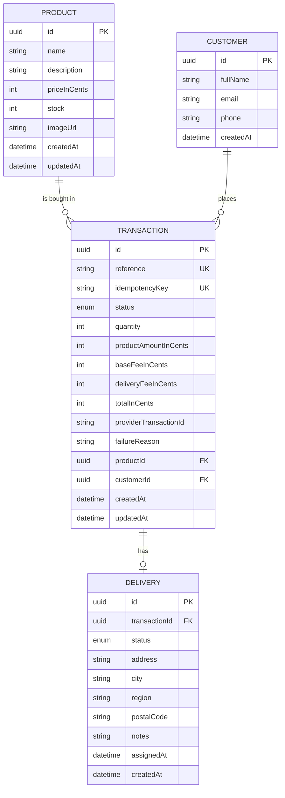

# Data Model: Back-end Base

All ids are UUIDs. Money is stored as integers in COP minor units (fields end in `InCents`).
This diagram is reused in the repository README.

## Enums

- `TransactionStatus`: `PENDING`, `APPROVED`, `DECLINED`, `VOIDED`, `ERROR`
- `DeliveryStatus`: `PENDING`, `ASSIGNED`

## Constraints

| Entity | Constraint |
|--------|-----------|
| Product | `stock >= 0` (CHECK), `priceInCents > 0` (CHECK) |
| Customer | index on `email` (not unique: guest checkout may repeat) |
| Transaction | `reference` unique, `idempotencyKey` unique, `quantity > 0` (CHECK), all `*InCents >= 0` (CHECK), `totalInCents = productAmountInCents + baseFeeInCents + deliveryFeeInCents` (CHECK), FKs to Product and Customer, default status `PENDING` |
| Delivery | `transactionId` unique FK (one delivery per transaction), `assignedAt` only set when status is `ASSIGNED` |

The CHECK constraints are added by hand in a SQL migration created with
`prisma migrate dev --create-only`, since `schema.prisma` cannot express them.

## Scope in this feature

The schema defines all four entities. Domain entities, ports, repositories and use cases are implemented
for Product only. Customer, Transaction and Delivery logic arrives in feature 002.
